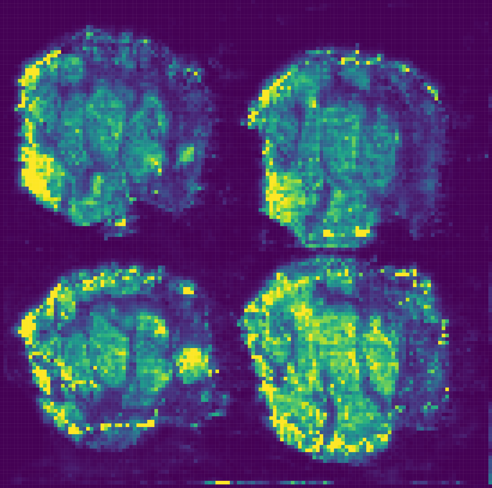

# TrIQ
The TrIQ algorithm [1] drastically improves the contrast of mass spectrometry imaging data visualizations, as shown in the figure below (data from [2]).

# Reference
Rosas-Román I, Winkler R. 2021. Contrast optimization of mass spectrometry imaging (MSI) data visualization by threshold intensity quantization (TrIQ) PeerJ Computer Science 7:e585 <https://doi.org/10.7717/peerj-cs.585>
