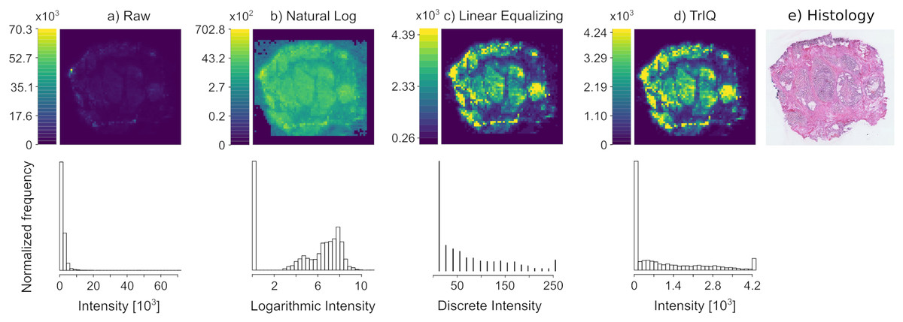

# TrIQ
The TrIQ algorithm [1] drastically improves the contrast of mass spectrometry imaging data visualizations, as shown in the figure below (data from [2]).

# R implementation
The file `TrIQ.R` contains the algorithm that can be included in R scripts. 
Minimal example: 

~~~
library( viridis )
library( MALDIquant )
library( MALDIquantForeign )

source( "TrIQ.R" )

spectra <- MALDIquantForeign::importImzMl( "../julia_example-data/imzML_DESI/ColAd_Individual/80TopL, 50TopR, 70BottomL, 60BottomR/80TopL, 50TopR, 70BottomL, 60BottomR-centroid.imzML", removeEmptySpectra = FALSE )
imgList  <- GetSlice( c( 885.55 ), spectra, 0.005 )
dim( imgList ) <- c(1, 1)

pdf("Carcinoma_DESI-MSI_TrIQ.pdf")
PlotSlices( GlobalTrIQ( imgList, 256, 0.98 ), 256 )
dev.off()
~~~
generates a PDF with the image

# Reference
1. Rosas-Román I, Winkler R. 2021. Contrast optimization of mass spectrometry imaging (MSI) data visualization by threshold intensity quantization (TrIQ) PeerJ Computer Science 7:e585 <https://doi.org/10.7717/peerj-cs.585>  
2. Oetjen J, Veselkov K, Watrous J, McKenzie JS, Becker M, Hauberg-Lotte L, Kobarg JH, Strittmatter N, Mróz AK, Hoffmann F, Trede D, Palmer A, Schiffler S, Steinhorst K, Aichler M, Goldin R, Guntinas-Lichius O, von Eggeling F, Thiele H, Maedler K, Walch A, Maass P, Dorrestein PC, Takats Z, Alexandrov T. 2015. Benchmark datasets for 3D MALDI-and DESI-imaging mass spectrometry. GigaScience 4(1):2105 <https://doi.org/10.1186/s13742-015-0059-4>

# Example data
Robert Winkler. 2023. mzML mass spectrometry and imzML mass spectrometry imaging test data [Data set]. Zenodo. <https://doi.org/10.5281/zenodo.10084132>
